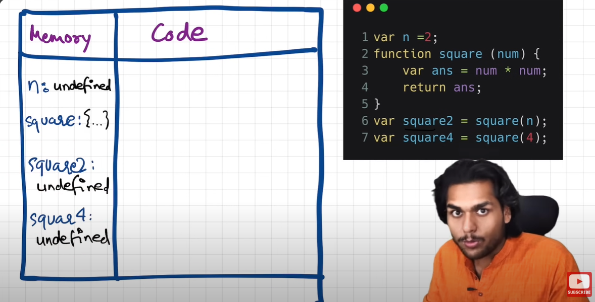
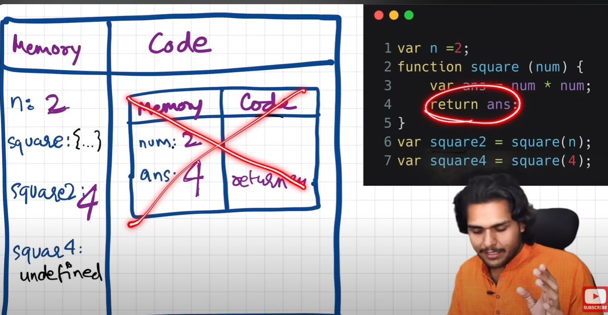
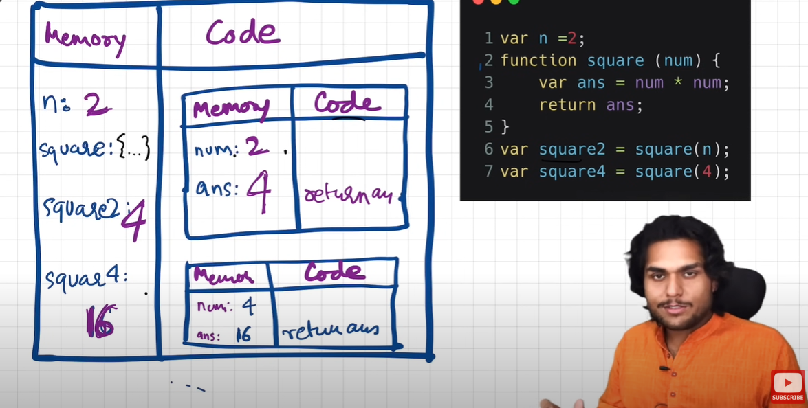
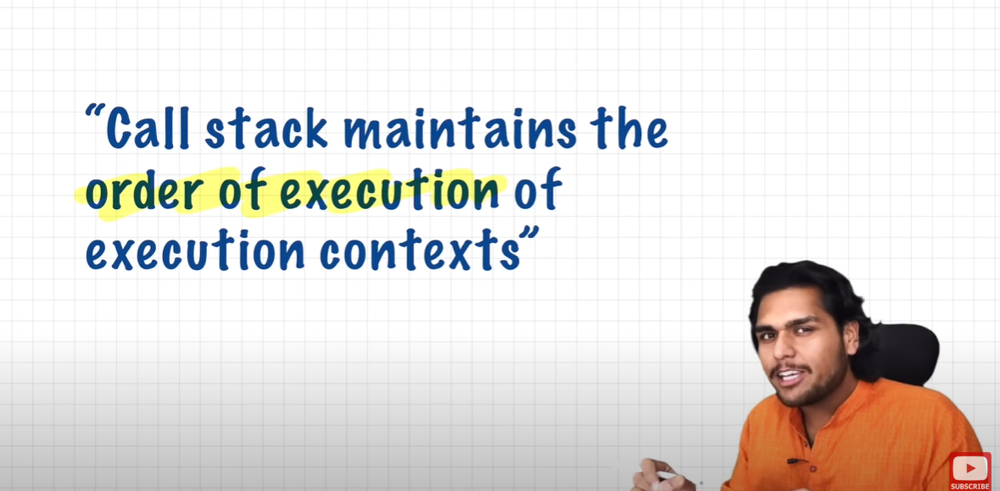
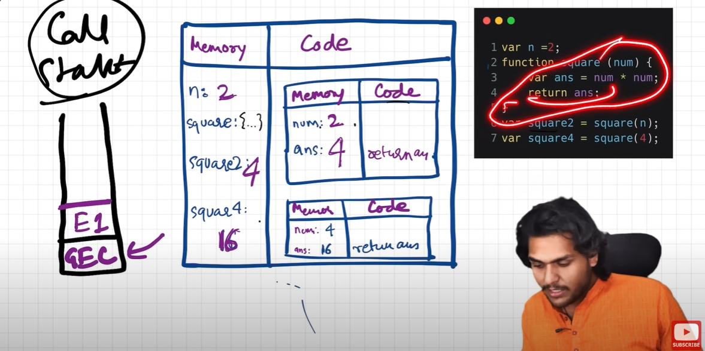
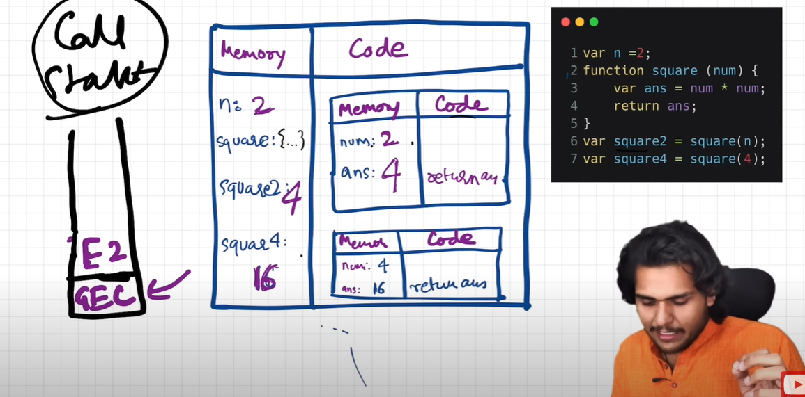
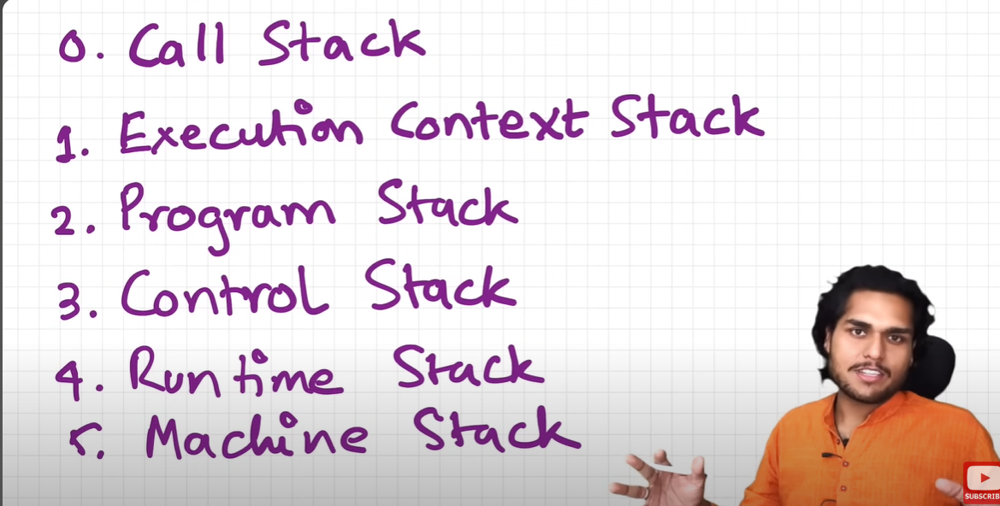

```
Every Thing in javaScript happens in Execution Context
```
```
Q.What happen when you run javaScript code.
Ans: Global Execution Context is created.
```

```
Example How Code is Executed.
-Firstly Global Execution Context is Created.It is Like a Big Box.
Important:- This Execution Context is created in two Phases.
1.Memory Creation Phase.
2.Code Execution Phase.
```

```
phase1:Memory Creation Phase Diagram:

-In first phase it create memory for all its global variables and stores undefined data type it is a special placeholder stores in first phase of variable  of Global Executon  Context.

DIAGRAM
```


```
Phase2 : Code Execution in global execution Context.
in Global execution context all the operatons and assignments are  Done And when function in invoked
then it create a brand new Execution Context. And that execution context  were also create in Two Phases 1st is memory creaton 2nd is code execution.
once first function is executed then its execution context is deleted. and stored the result in in global execution context variable.
```




```
When Whole code is executed.

```



```
Call Stack :-

```


```
 and this whole execution context handels through call stack

step1 :- Global Executon context were inserted inside the stack.
step 2: when function invoked then functional execution context will also pushed inside the stack once its ececute then the  function executon context 1 were deleted and  function executon context2 were pushed .

Diagram:-
```

```
Firstly global execution context is pushed and then function execution context is pushed.one FEC1 is execute it will deleted from call stack.and FEC2 will pushed and when it execute it deleted.

Diagram 2 of FEC2 how it will pushed
```



```

And this Call Stack Have Different Names :
Diagram Of that Name:
```

