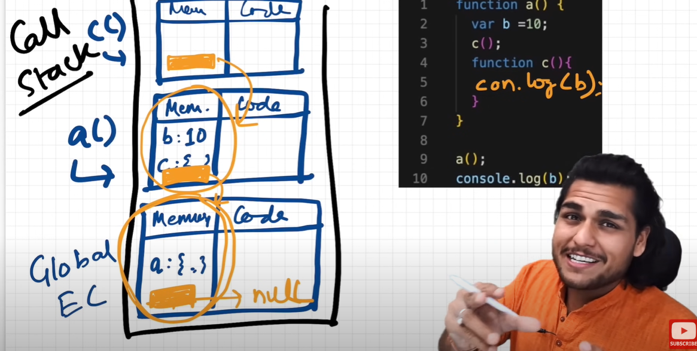

```
1. Scope of a variable is directly dependent on the lexical environment.
2. Whenever an execution context is created, a lexical environment is created. Lexical environment is the local memory along with the lexical environment of its parent. Lexical as a term means in hierarchy or in sequence.
3. Having the reference of parent's lexical environment means, the child or the local function can access all the variables and functions defined in the memory space of its lexical parent.
4. The JS engine first searches for a variable in the current local memory space, if its not found here it searches for the variable in the lexical environment of its parent, and if its still not found, then it searches that variable in the subsequent lexical environments, and the sequence goes on until the variable is found in some lexical environment or the lexical environment becomes NULL.
5. The mechanism of searching variables in the subsequent lexical environments is known as Scope Chain. If a variable is not found anywhere, then we say that the variable is not present in the scope chain.

```

```
Diagram
```


```
Q:-Whai is Lexical Parent?
Ans:- Lexical Parent Means only the single parent function of that function whera that individual Function Seats.
```
```
Q.Lexical Environment is What
Ans: Local Memory + refrence of the Lexical Environment of its Parent
```
```
And the whole Chain of lexical Enivironment called Scope Chain
```