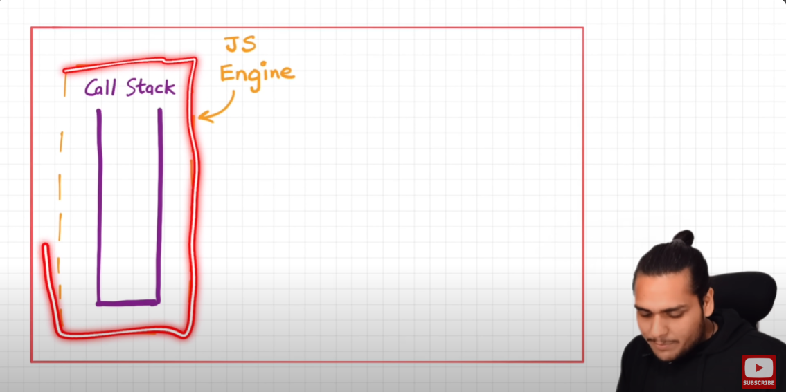
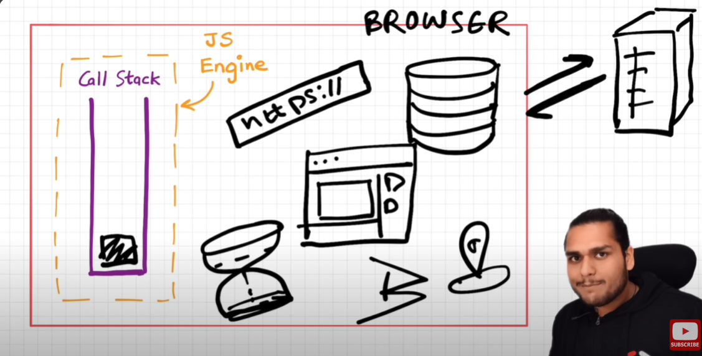
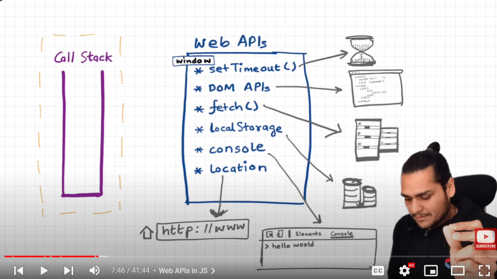
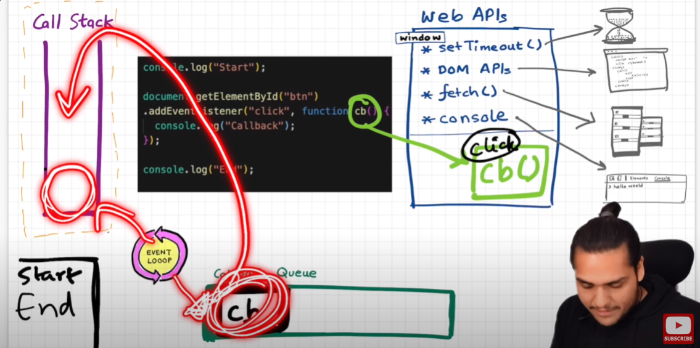
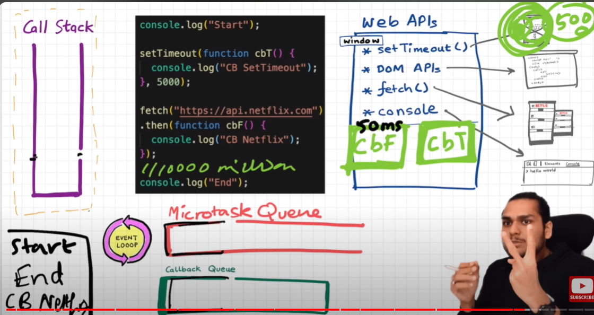
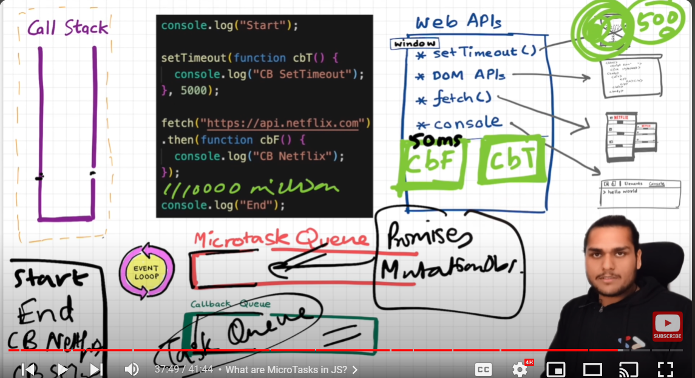

1
```

The callStack is inside the JavaScriptEngine.
and this JsEngine is inside a Big box that is Browser.So Basically .
The Browser have JavaScriptEngine and javaScript Engine have CallStack and in callStack our program Run.


```


2.


```
Browser have not only the JavaScript Engine it have also its Local Storage,Timer,url(https:/)-->to fetch some websites and after fetching it also display on our UI.,Bluetooth,Jio Location etc.
```





3
```
To Acces all these superPowers like url,Bluetooth ,jio Location,timer through our javaScript Code inside the jS engine in callStack. We have to make connections with them.The JSENGINE need some ways to access this powers.

```


```
Lets See how we make connections this super powers.

--> To Access all those SuperPower we need Web APIs.
```


```

Web APIs is the part of Browser through which we can access all the Super Powers which  BRowsers have. And Browser Gives sccess too the JS Eng To access thise super powers through web apis.


And will access all the webAPIs inside the callStack  through window object(global object.)


In the case of browsers browser gives the faciltiy to used all the SuperPower through webAPIs which is in Global object. or Window. all the APIs are attached to window.
```



4.
```
Q4 IMPORTANRT --> What is event loop ..

It is like a gateKeeper between CallStack and callback Queue.
Event Loop have only one job.It continuous Monitor callStack and callBack Queue.If the callStack is empty and that eventLooop sees that there is also a function in callback Queue(Task Queue) to execute then its immediately pushed that function inside the call Stack and it Execute that function immediately.
Diagram:-
```

Important EventLoop Diagram How its Works Beautifully.



```
5

MicroTask Queue it is also known as high Priority queue  only itpasses only those callback functions which is passed  through a promish like Fetch(). In fetch (then,catch ). functions are passed in .then,.catch as a callback.


```


```

1.task queue --> where all the callback are are kept and monitored through our eventLoop.
  
2.Micro Task Queue --> where all the callback which passes  inside  promise(then,catch) will put inside this miro task queue.It is also Knonwn as High Priority Queue.

Both are different Queue.

Final Diagram
```




6.
```
Whole procedure in Some line : Explaination


If we pass callback in web APIs like setTimeout,fetch,addEventListner it register that callback in Web APIs Environment or Browser Environment . and then that timer over or event like click event occurs on that button which accessecd by DOM APIs . that its push inside that TaskQueue and event Loop monitors and then push that function inside the call stack and its execute immediatelly.
```

```
Some  Web APIs-
1.DOM
2.fetch()
3.console
4.setTimeout and many more.
It wrapped in a window Object it is a global object
and that Global object will attach to JavaScript Engine. 
```